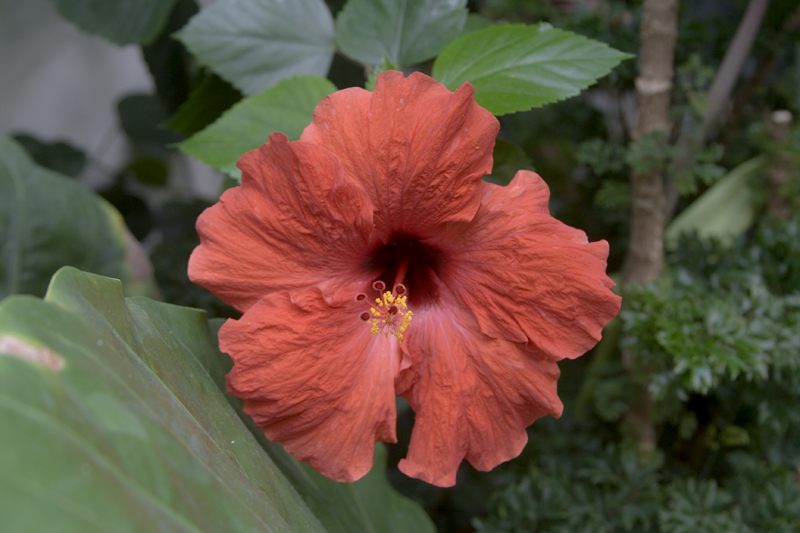
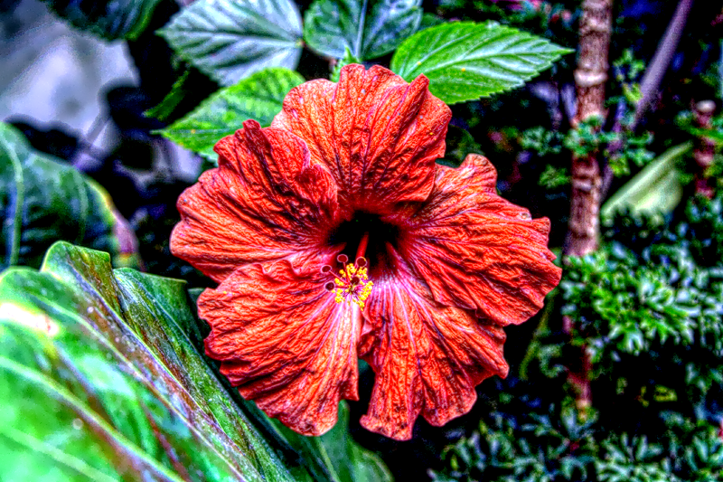
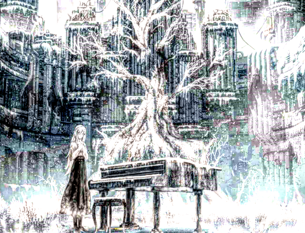
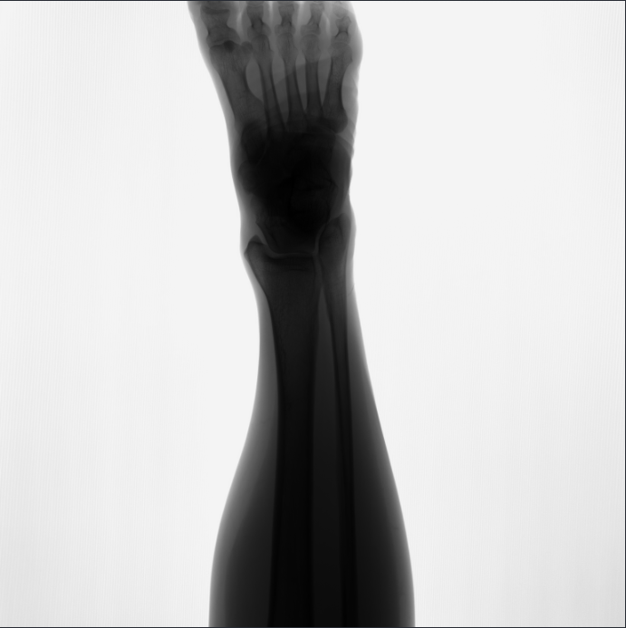
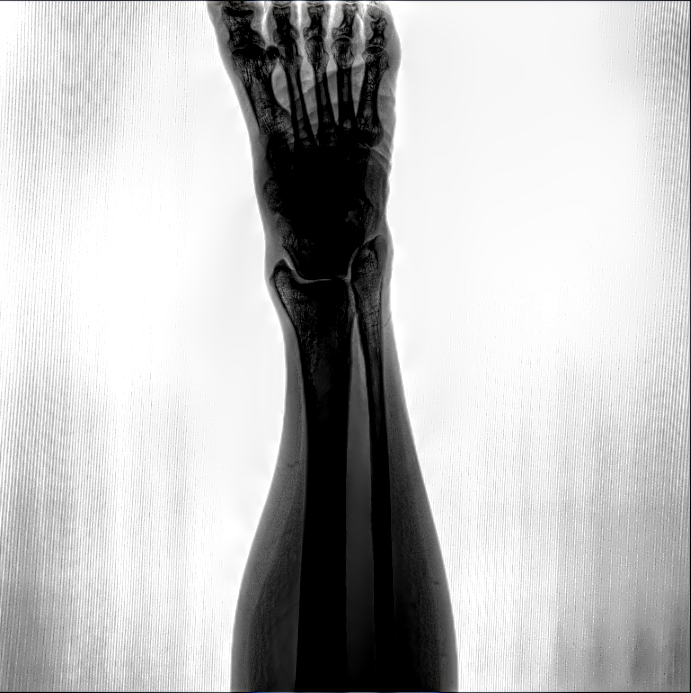

## Install

```
$ pip install localaplace
```

This is an implement of Local Laplace Filter algorithm [1]  [[Paper](https://people.csail.mit.edu/hasinoff/pubs/ParisEtAl11-lapfilters-lowres.pdf)]. Just see the effect below.


|Image modal|   Original    |   Enhanced    |
|:---:|:------------:|:------------:|
|RGB (800 × 533)|    |    |
|RGBA (600 × 460)|    |    |
|CT (3072 × 3072)|    |    |


> This is a boring code when I attempt to finish my computer vision homework, but no available python package is found on PyPi

## Usage

Demo is as follows, the only function is `local_laplace_filter` (Please see my detailed comment of the function to see the meaning of arguments):

```python
import os

import cv2
import localaplace as llp

image = cv2.imread('./images/flower.png', cv2.IMREAD_UNCHANGED)

result = llp.local_laplace_filter(
    image, 0.2, 0.5, 0.8, 100, 
    num_workers=-1, 
    verbose=1, 
    return_layers=False
)

# save result to disk
if not os.path.exists('results'):
    os.makedirs('results')
cv2.imwrite('./results/flower_enchanced.png', result)
```

If you are interested in the Laplace Pyramid, set `return_layers` as `True` to get layers:

```python
result, layers = llp.local_laplace_filter(
    image, 0.2, 0.5, 0.8, 100, 
    num_workers=-1, 
    verbose=1, 
    return_layers=True
)

# save inner layers to disk
for i, layer_image in enumerate(layers):
    cv2.imwrite(f'./results/layer_{i + 1}.png', layer_image)
```


## Reference

[1] Paris, Sylvain, Samuel W. Hasinoff, and Jan Kautz. "Local Laplacian filters: edge-aware image processing with a Laplacian pyramid." Communications of the ACM 58.3 (2015): 81-91